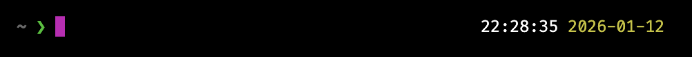
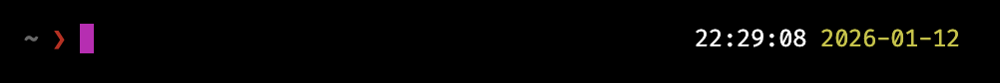
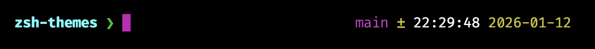
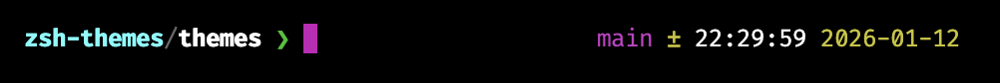
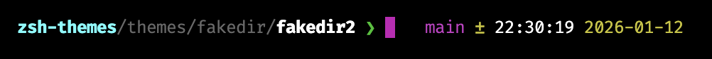

# ZSH Themes

> Opinionated ZSH themes

[](https://github.com/toonvanvr)

## Setup

### Requirements

- [Oh My Zsh](https://ohmyz.sh/)
- A [Nerd Font](https://github.com/ryanoasis/nerd-fonts) installed and set as your terminal font

### Automatic installation

<details>
<summary>Automatic installation instructions</summary>

```sh
# Download the theme
curl -fsSL https://raw.githubusercontent.com/toonvanvr/zsh-themes/main/themes/toon.zsh-theme -o ~/.oh-my-zsh/themes/toon.zsh-theme
```

```sh
# Set it as your theme (overwrite it somewhere in your ~/.zshrc)
ZSH_THEME="toon"
```

</details>

### Manual installation
<details>
<summary>Manual installation instructions</summary>

1. Copy `themes/toon.zsh-theme` to `~/.oh-my-zsh/themes/`
2. Set `ZSH_THEME="toon"` in your `~/.zshrc`
3. Restart your terminal

</details>

### Nerd Font Installation

<details>
<summary>Cross-platform Nerd Font installation</summary>

#### macOS
```bash
brew tap homebrew/cask-fonts
brew install --cask font-hack-nerd-font
```
Then set Hack Nerd Font as your terminal font.

#### Linux (Ubuntu/Debian)
```bash
sudo apt update
sudo apt install fonts-hack-nerd-font
```
Then configure your terminal to use Hack Nerd Font.

#### Linux (Arch)
```bash
sudo pacman -S ttf-hack-nerd
```

#### Windows
1. Download the latest release from [Nerd Fonts GitHub](https://github.com/ryanoasis/nerd-fonts/releases)
2. Extract and install the font (e.g., Hack Regular Nerd Font Complete.ttf)
3. Set it as your terminal font in your terminal settings

#### Other Platforms
Visit the [Nerd Fonts releases page](https://github.com/ryanoasis/nerd-fonts/releases) for more options.
</details>


## Themes

### [`toon.zsh-theme`](./themes/toon.zsh-theme)

Home directory



Error exit code



Random directory


Git root directory



Git subdirectory



Git nested subdirectory

